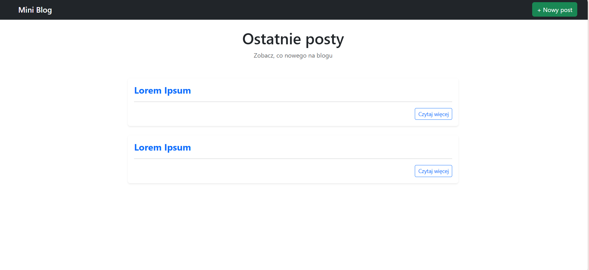
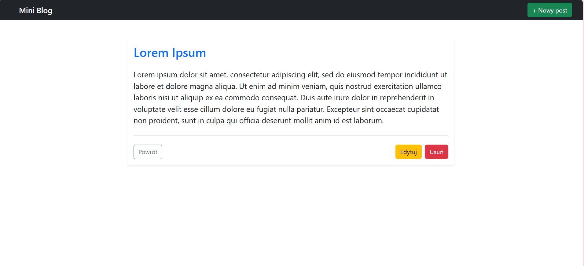
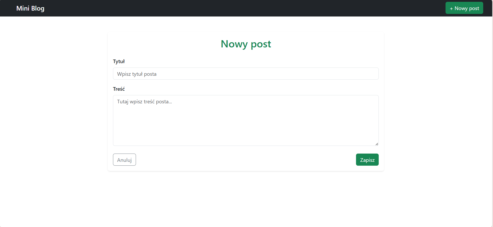
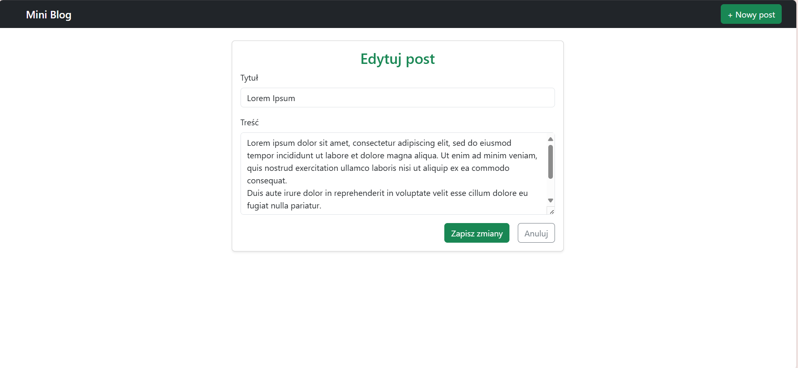

# Mini Blog

---

Prosta aplikacja blogowa stworzona przy użyciu:

- **Flask**
- **SQLAlchemy**
- **HTML**
- **CSS**
- **Bootstrap 5**

Aplikacja została wdrożona na platformie PaaS – **Render**.

Aplikacja dostępna pod adresem:

> (https://blog-app-squ2.onrender.com/)  

---

## Podgląd aplikacji

### Strona główna

  

### Więcej informacji

  

### Formularz dodawania posta

  

  

---